# ✨ Jibi - Where Innovation Meets Elegance

> **Transform your wildest ideas into stunning web applications using nothing but natural language. Experience the future of development today.**


[](https://jibi.dev)
[](https://openai.com)
[](https://jibi.dev)
[](https://jibi.dev)

</div>

---

## 🚀 **The Magic Behind Jibi**

**Jibi** isn't just another web builder - it's a revolutionary platform that bridges the gap between human creativity and artificial intelligence. Imagine describing your dream application in plain English and watching it materialize before your eyes, pixel by pixel, component by component.

### 🧠 **How The AI Magic Works**

```mermaid
graph LR
    A[💭 Your Idea] --> B[🤖 AI Processing]
    B --> C[⚡ Code Generation] 
    C --> D[🎨 Live Preview]
    D --> E[✨ Your Dream App]
```



1. **💭 Natural Language Input**: Simply describe what you want - "Create a modern e-commerce site with dark theme"
2. **🤖 AI Understanding**: Advanced language models parse your requirements with contextual understanding
3. **⚡ Intelligent Code Generation**: AI generates React components, styling, and functionality in real-time
4. **🎨 Live Preview**: Watch your application come to life in a sandboxed environment
5. **✨ Iterative Refinement**: Continuously improve and modify with simple conversational commands

---

## 🎭 **The Journey: From Vision to Reality**

### 🌟 **What I Discovered Building This**

Creating Jibi has been an incredible journey of discovery, innovation, and growth. Here's what made this project truly special:

#### 🔥 **Technical Mastery Gained**

- **🧬 Advanced AI Integration**: Learned to harness the power of OpenAI's GPT models for code generation
- **⚛️ React Ecosystem Mastery**: Deep dive into modern React patterns, hooks, and component architecture  
- **🎨 Design System Creation**: Built a sophisticated design system with elegant dark themes
- **🔄 Real-time Communication**: Implemented WebSocket-based real-time updates and streaming
- **🏗️ Microservices Architecture**: Designed scalable backend with MCP (Model Context Protocol) servers
- **☁️ Cloud Infrastructure**: Integrated cloud services for sandboxed execution environments

#### 💡 **Innovation Breakthroughs**

- **🎯 Natural Language to Code**: Bridged the gap between human intent and machine execution
- **🖤 Elegant UX Design**: Created a sophisticated black-theme interface that's both beautiful and functional
- **⚡ Instant Feedback Loop**: Achieved near-instantaneous code generation and preview
- **🔮 Predictive UI**: AI understands design patterns and automatically applies best practices

#### 🚀 **Personal Growth**

- **🧠 Problem-Solving Skills**: Tackled complex challenges in AI-human interaction design
- **🎨 Design Thinking**: Developed an eye for elegant, user-centric interface design
- **⚡ Performance Optimization**: Learned to build lightning-fast, responsive applications
- **🌐 Full-Stack Proficiency**: Gained expertise across the entire technology stack

---

## 🏗️ **Architectural Excellence**

### 🎯 **Core Components**

```typescript
┌─────────────────┐    ┌──────────────────┐    ┌─────────────────┐
│   🎨 Frontend   │◄──►│   🤖 AI Agent    │◄──►│ ☁️ Sandbox Env  │
│   React + TS    │    │  BAML + OpenAI   │    │  Cloud Services │
└─────────────────┘    └──────────────────┘    └─────────────────┘
        ▲                        ▲                        ▲
        │                        │                        │
        ▼                        ▼                        ▼
┌─────────────────┐    ┌──────────────────┐    ┌─────────────────┐
│ 🎭 Elegant UI   │    │ 🧠 Smart Agent   │    │ 🔒 Safe Exec    │
│ Dark Theme      │    │ Code Generation  │    │ Isolated Env    │ 
│ Glass-morphism  │    │ Context Aware    │    │ Real-time       │
└─────────────────┘    └──────────────────┘    └─────────────────┘
```

### 🔮 **The Intelligence Layer**

1. **🧠 BAML Integration**: Sophisticated AI model communication layer
2. **💬 Context Preservation**: Maintains conversation history and project context  
3. **🎯 Smart Code Generation**: Understands modern web development patterns
4. **🔄 Iterative Improvement**: Learns from user feedback and refines output

---

## 🎨 **Design Philosophy: Elegance in Darkness**

### 🖤 **The Black Theme Revolution**

Jibi's design isn't just about aesthetics - it's about creating an environment where creativity flourishes:

- **🌑 Deep Black Canvas** (`#0a0a0a`): Reduces eye strain during long coding sessions
- **✨ Subtle Gradients**: Creates depth without overwhelming the user
- **🔮 Glass-morphism**: Modern, sophisticated card designs with blur effects
- **💎 Premium Typography**: Ultra-light fonts with perfect letter spacing
- **⚡ Smooth Animations**: 60fps transitions that feel natural and responsive

### 🎭 **User Experience Principles**

1. **🎯 Intuitive First**: Every interaction should feel natural and predictable
2. **⚡ Speed of Thought**: Near-instantaneous feedback and responsiveness  
3. **🎨 Beautiful by Default**: Every screen should be a work of art
4. **🧠 Smart Assistance**: AI should anticipate user needs and provide helpful suggestions

---

## 🚀 **Quick Start Guide**

### 📋 **Prerequisites**

- **Node.js 20+** - The JavaScript runtime
- **Python 3.12+** - For the AI backend
- **OpenAI API Key** - Your gateway to AI magic
- **Cloud Account** - For cloud sandboxing services

### ⚡ **Installation**

```bash
# Get the magic ✨
git clone https://github.com/RajPrakash681/Jibi
cd Jibi

# Install Python dependencies 🐍
pip install -r requirements.txt

# Install frontend dependencies ⚛️
cd frontend && npm install

# Set up your AI key 🔑
beam secret create OPENAI_API_KEY 'your-openai-api-key'

# Launch the magic 🚀
npm run dev
```

### 🎮 **Usage**

1. **🌟 Visit the Landing Page** - Experience the elegant dark theme
2. **🔐 Sign In/Sign Up** - Create your account with our sophisticated auth flow
3. **💭 Describe Your Vision** - Tell Jibi what you want to build
4. **⚡ Watch the Magic** - See your application come to life in real-time
5. **🔄 Iterate and Refine** - Continuously improve with natural language commands

---

## 🎯 **What Makes This Special**

### 🏆 **Unique Value Propositions**

- **🎨 Design Excellence**: Not just functional, but breathtakingly beautiful
- **🧠 AI Innovation**: Cutting-edge natural language to code generation
- **⚡ Lightning Performance**: Optimized for speed and responsiveness
- **🔮 Future-Ready**: Built with tomorrow's web standards in mind
- **💎 Premium Experience**: Every detail crafted for sophistication

### 🌟 **Real-World Impact**

This project demonstrates the future of software development where:
- **👨‍💻 Developers** can prototype ideas at the speed of thought
- **🎨 Designers** can see their visions implemented instantly  
- **🚀 Entrepreneurs** can validate concepts without technical barriers
- **🎓 Students** can learn by experimenting with AI-generated code

---

## 🤝 **Contributing to the Future**

Love what you see? Help make Jibi even more amazing!

```bash
# Fork the repository
git fork https://github.com/RajPrakash681/Jibi

# Create your feature branch
git checkout -b feature/AmazingFeature

# Commit your changes
git commit -m 'Add some AmazingFeature'

# Push to the branch
git push origin feature/AmazingFeature

# Open a Pull Request 🎉
```

---


### 🙏 **Special Thanks**

- **OpenAI** - For the incredible GPT models that power our AI
- **Cloud Services** - For providing the sandboxed execution environment
- **BAML** - For the elegant AI integration framework
- **React Community** - For the amazing ecosystem and tools

---

<div align="center">

### ✨ **Built with Passion, Powered by AI, Designed for the Future** ✨

  **[📚 Documentation](https://docs.jibi.dev)** | **[🐛 Report Bug](https://github.com/RajPrakash681/Jibi/issues)** | **[💡 Request Feature](https://github.com/RajPrakash681/Jibi/issues)**

---

**Made with 💖 by [Raj Prakash](https://github.com/RajPrakash681)**

*"The future belongs to those who believe in the beauty of their dreams." - Eleanor Roosevelt*

</div>
```

4. **Add `.env`**

Create an `.env` file in `/frontend`

You’ll need a [Beam token](https://platform.beam.cloud/settings/api-keys) and the websocket URL, printed in your shell after running the command below.

```bash
VITE_BEAM_WS_URL=your-agent-ws-url # URL printed in your shell after running `beam serve` - fill this in after running the command below
VITE_CLOUD_TOKEN=your-cloud-token # Get your cloud service token from your provider
```

## Usage

### Start the Agent

The agent handles real-time communication with the client/frontend:

```bash
beam serve src/agent.py:handler
```

> Paste the websocket URL printed in your shell into your `.env` file above

### Run the Frontend

In a new terminal window, run:

```bash
cd frontend
npm run dev
```

### BAML / Prompts

Prompts are defined in `baml_src/build.baml`:

- **EditCode Function** - Main function for code generation
- **CodeChanges Schema** - Defines the structure of AI responses
- **Test Cases** - Validate prompt behavior

> If you want to change the prompt, edit `baml_src/build.baml` and run `make generate` to regenerate the BAML clients

### Sandbox Environment

The sandbox environment is managed in `src/tools.py`:

- Node.js 20 base image
- React + Vite + shadcn/ui template
- Other deps: React Router, Recharts, TanStack Query, etc.
